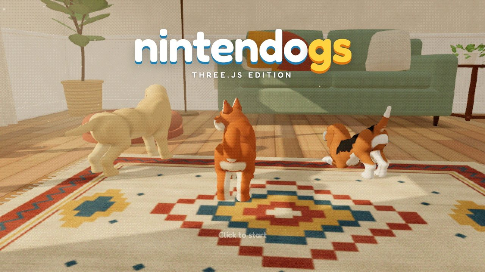
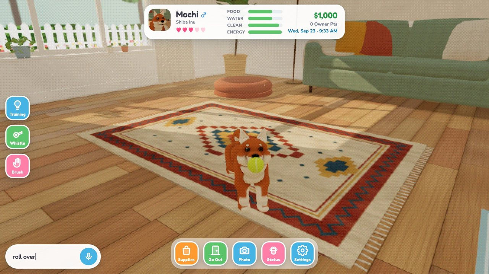
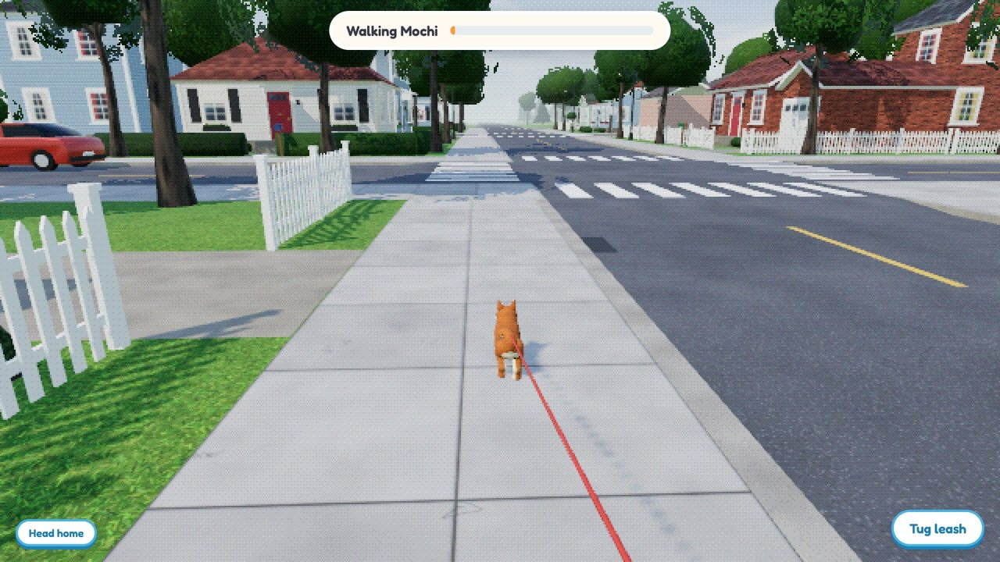
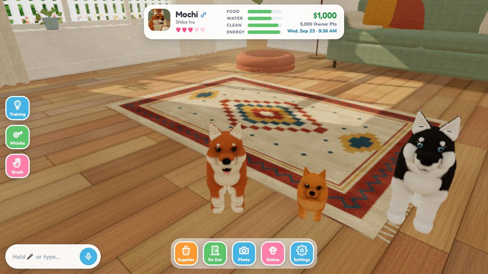

# nintendogs · three.js edition

A fan remake of Nintendo's *Nintendogs* in the browser, built with [three.js](https://threejs.org). Adopt a puppy, pet it, teach it tricks by voice, take it for walks around town and enter it in contests. The puppies are generated procedurally: every breed is sculpted in code, rigged, animated and covered in shell-textured fur. There are no pre-made 3D models.

| | |
|---|---|
|  |  |
|  |  |

## Play

```sh
npm install
npm run dev      # http://localhost:5178
```

`npm run build` produces a static site in `dist/` that can be hosted anywhere.

### On a phone

The game plays on phones and tablets in portrait or landscape, with touch controls throughout. To try the dev server on a phone on the same Wi-Fi, open `http://<your computer's IP>:5178`. Voice commands need a secure (HTTPS) page, so over plain HTTP the 🎤 button offers the keyboard instead; a static build on any HTTPS host gets the microphone too. Adding the page to your Home Screen runs it full screen.

### How to play

- **Pet** your puppy by stroking it with the mouse or your finger. It loves chin, head and belly rubs, and lots of belly rubs make it roll over.
- **Lead** it: click (or touch) and hold on the floor and it follows your hand.
- **Call** it: hold 🎤 (or the Space bar) and say its name, or type into the box. On touch screens, tap 🎤 and speak, or tap ⌨️ to type. Voice uses the Web Speech API (Chrome, Safari).
- **Zoom** with the mouse wheel, or pinch with two fingers.
- **Play**: pick a toy from Supplies and flick it to throw. Pull on the tug rope, squeak the duck.
- **Teach tricks** the Nintendogs way: press *Training*, guide your pup into a pose (stroke down its back to sit, drag its head down to lie down, swipe sideways across it to roll over, circle its head to spin…), and when the light bulb appears, say any word. Repeat until it's learned; from then on that word is the command.
- **Care** for it: food, water, brushing and baths. Hunger, thirst and dirt change in real time and are saved in your browser.
- **Go out**: draw a route on the town map and walk your dog on a leash (presents, other dogs and poop to clean up), play in the park, shop at Pet Supply, sell treasures at the Secondhand Shop, adopt more puppies at the Kennel, and compete in the Disc, Obedience and Agility contests at the Gym.

Settings has a **Look** option: *DS dither* (the default: half-res pixels with 15-bit ordered dithering, like the DS screens), *Chunky DS*, or *Modern*.

## Breeds

Labrador, Golden Retriever, Shiba Inu, Siberian Husky, Pembroke Welsh Corgi, Beagle, Miniature Dachshund, Chihuahua, Pug, Toy Poodle, Dalmatian, German Shepherd, Cavalier King Charles Spaniel, Jack Russell Terrier, Pomeranian, Miniature Schnauzer, Shih Tzu and Yorkshire Terrier, each with 2–3 coats.

## How the dogs are made

- **Sculpt** (`src/dog/design.ts`, `src/dog/breeds.ts`): each breed is a set of proportions (build, head, muzzle, ears, tail). These drive a skeleton and a signed-distance-field sculpt of smooth-blended primitives.
- **Mesh** (`src/dog/surfaceNets.ts`, `src/dog/dogModel.ts`): the SDF is meshed with surface nets and projected onto the exact surface. Each vertex gets skin weights, coat colour (`src/dog/patterns.ts`), fur length, hair direction and baked ambient occlusion.
- **Fur** (`src/dog/fur.ts`): shell texturing drawn as a single instanced draw per dog, with strand-level detail up close and mip-style tufts further away. Wetness, soap, dirt and brushing are shader parameters.
- **Animation** (`src/dog/rig.ts`): poses are authored as leg directions so they transfer between breeds, and a contact solver keeps the dog on the floor. The walk, trot and gallop gaits use two-bone foot IK so paws stay planted. There are layers for tail wag, look-at, blinking, panting and floppy ears.
- **Behaviour** (`src/dog/brain.ts`): a small activity system covering idling, wandering, sniffing, coming when called, following your hand, being petted, eating, sleeping, fetch, tug of war and tricks.

## Project layout

```
src/dog/      procedural dogs: breeds, sculpt, mesher, fur, rig, behaviour
src/game/     game loop, scenes, save data, items, tricks, voice, audio
src/world/    rooms, town, park, contest venues, props and accessories
src/ui/       DS-style HUD and menus
src/tests/    stand-alone test pages (open /?test=<name>)
```

Handy URLs while developing: `/?viewer=shiba,pug` (model viewer), `/?quickstart=corgi` (skip straight to a home with that breed), `/?test=room`, `/?test=town`, `/?test=audio`.

## Credits

Dog barks and whines are trimmed from public-domain and CC0 recordings on Wikimedia Commons (see `public/sfx/CREDITS.md`). All other sounds and the music are synthesised in code. Fonts: Fredoka and Nunito via Fontsource.

## Disclaimer

This is an unofficial fan project made for fun. It is not affiliated with or endorsed by Nintendo. *Nintendogs* is a trademark of Nintendo.
